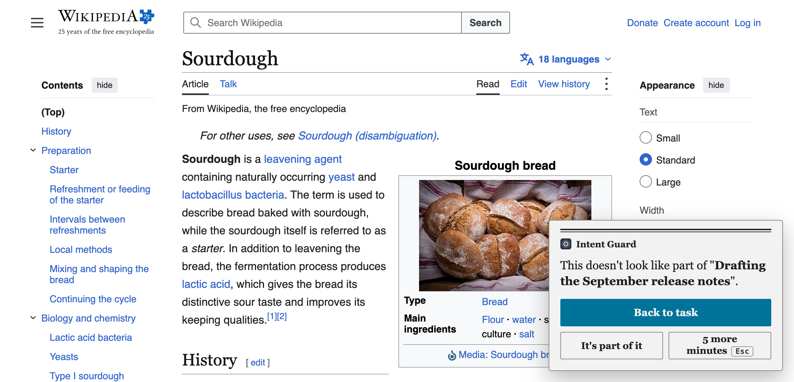
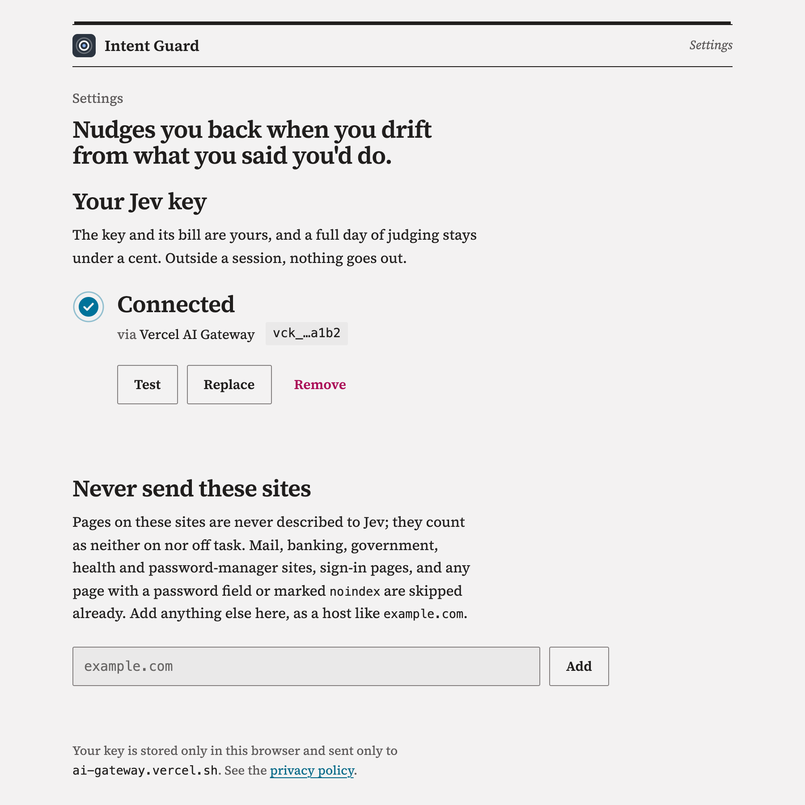
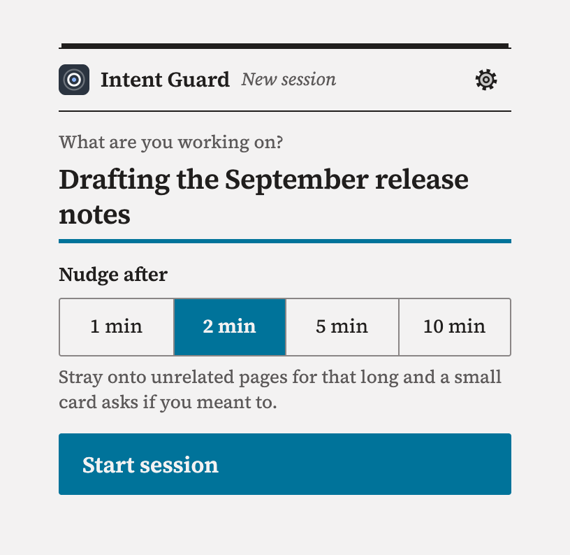

# Intent Guard

Type what you're working on. Intent Guard checks each page against that, so a YouTube tutorial for your task is fine and YouTube Shorts gets you a "back to task" card after a couple of minutes. It is a way to stay focused without a website blocker.

[](https://github.com/dgr8akki/intent-guard/actions/workflows/ci.yml)

<picture>
  <source media="(prefers-color-scheme: dark)" srcset="docs/nudge-dark.png" />
  
</picture>

## Why not a blocker

Blocklists judge domains, and work does not happen by domain. The documentation I need is on the same site as the video I should not be watching. The article that is half research and half procrastination lives on a site I could not have listed in advance.

Intent Guard reads the heading of the page you are on and asks one question: does this help with the task you typed? You pick how long you're allowed to wander (1, 2, 5 or 10 minutes) before it says anything. After that, a small card appears in the corner of the page. It has three buttons: Back to task (goes to the last page that was on task), It's part of it (allow this site for the session), and 5 more minutes. Escape snoozes it too. Nothing is blocked and nothing makes a sound. If you keep browsing, the card does not come back until another drift period has passed.

"Loosely related" counts as off task. Reading about Goa's history when you're meant to be booking a flight is exactly the thing this is for. If you disagree, one click allows the site.

## Install

Intent Guard isn't on the Chrome Web Store yet. To install from source:

1. Get a build: grab `intent-guard-x.y.z.zip` from [Releases](https://github.com/dgr8akki/intent-guard/releases) and extract it. A clone works too.
2. In `chrome://extensions`, switch Developer mode on.
3. Load unpacked, then point it at the extracted folder (in a clone, at `src/`).
4. Settings appear by themselves the first time. Choose [TypeSafe](https://console.typesafe.ai/keys) or [Vercel AI Gateway](https://vercel.com/docs/ai-gateway/authentication-and-byok/api-keys) as the source of your key, paste it in and hit Connect. A key that fails a test call is not stored. The gear in the popup brings this page back later.
5. Open the popup from the toolbar, write down the task and press Start session.

Intent Guard spends from your account, not mine. A full day of browsing costs a fraction of a cent; TypeSafe's price in September 2026 was $0.042 per million input tokens. On Vercel, set a [budget](https://vercel.com/docs/ai-gateway/observability-and-spend/budgets) before you start.

<picture>
  <source media="(prefers-color-scheme: dark)" srcset="docs/options-dark.png" />
  
</picture>

## A session

Once connected, the popup is just a field: "What are you working on?" Type the task, pick the drift time and start. From then on the popup shows the session clock, whether you're currently off task and when the next card is due, and which sites you've allowed, each with a cross to un-allow it. There is also a Don't judge this site button for the page you're looking at.

If it can't tell, it does nothing: unclear pages don't start or stop the clock. Sessions end on their own after 90 minutes without a page being checked, or after 8 hours. Past 4 hours the popup asks whether you're still on it. When no session is running it sends nothing at all.

<picture>
  <source media="(prefers-color-scheme: dark)" srcset="docs/popup-dark.png" />
  
</picture>

## How a page is judged

Every judgment is a call to [Jev](https://typesafe.ai), TypeSafe's System One model, which returns probabilities for a fixed set of answers instead of writing text. Each page costs one request (repeat visits come from a cache that lasts until the browser closes), and the question is:

| Question                                           | Levels                                                                 |
| -------------------------------------------------- | ---------------------------------------------------------------------- |
| How much does this page help with the user's task? | Distraction · Loosely related · Useful for the task · Exactly the task |

The two upper levels are summed against the two lower ones. A page that's 55% "useful" and 37% "exactly the task" is 92% on task, even though no single level is confident. Below 60% on either side the page is unclear, and unclear pages leave the clock alone. A site the model has already put on task is not asked about again during the session.

## What it sends, and why it can

| Permission                          | Why                                                                                                                                                  |
| ----------------------------------- | ---------------------------------------------------------------------------------------------------------------------------------------------------- |
| Content script on all http(s) pages | Reads the page heading and description during a session; shows the card. Plain-http pages are included so intranet and local tools count as work too |
| `https://api.typesafe.ai/*`         | Sends the task and page summary to Jev, if you picked TypeSafe                                                                                       |
| `https://ai-gateway.vercel.sh/*`    | Sends the task and page summary to Jev, if you picked Vercel                                                                                         |
| `storage`                           | Keeps your API key, session and never-send list in this browser                                                                                      |
| `scripting`                         | Adds the page checker to tabs that were already open when you installed or started a session                                                         |
| Host access on all http(s) pages    | Lets the extension see which tabs are open pages and reach them; the content script already runs there, so Chrome shows the same warning             |

For each page, only the origin and path, the title and its heading and description (or up to 300 characters of opening text when it has neither) are sent, either to TypeSafe or through Vercel AI Gateway, which hands them on to TypeSafe. Query strings, URL fragments, form contents and embedded frames are never sent. Mail, banking, government, health and password-manager sites, sign-in pages, and any page with a password field or marked `noindex` are never described at all; add your own under Never send these sites in settings, or with Don't judge this site in the popup. The full policy is in [PRIVACY.md](PRIVACY.md).

## When it does nothing

| What you see                   | Why, and what to do                                                                                        |
| ------------------------------ | ---------------------------------------------------------------------------------------------------------- |
| No card ever appears           | Check a session is running and your key is saved. The popup shows a line under your task when checks fail. |
| A card on a page you need      | Click It's part of it to allow the site for this session, or phrase the task more broadly.                 |
| Nothing on `chrome://` or PDFs | Chrome doesn't let extensions run there. Those pages don't count either way.                               |
| The card is late               | The provider may be rate-limiting; the next page re-checks.                                                |

Known limits: it judges the heading and opening text only, so a page whose relevant part is far down may be judged by its header. Endless feeds on one URL are judged once per visit, not per scroll. The prompt is in English, and pages in other languages are judged less reliably.

## Development

Node.js 22+ is required.

```sh
npm install
npm run check      # ESLint, Prettier in check mode, node --test
npm run eval       # live evaluation against Jev (.env must hold TYPESAFE_API_KEY or AI_GATEWAY_API_KEY)
npm run icons      # re-render src/icons from assets/icon.svg with headless Chrome
npm run package    # builds dist/intent-guard-<version>.zip for the Chrome Web Store
```

```
src/
├── manifest.json
├── background.js          Worker glue: chrome.storage and tabs in, lib/service.js decides
├── content/               Page snapshot, URL-change detection and the card
├── popup/                 Start and end a session
├── options/               Connect, test, replace or remove the API key; never-send list (opens on install)
└── lib/
    ├── jev.js             Jev client (shared with the sibling extensions, see SHARED.md)
    ├── guard.js           Question, verdict rules, drift clock, judge cache
    ├── service.js         What the worker decides, behind a storage adapter
    └── exclusions.js      Sites that are never described
test/                      Unit tests; jsdom pages for the content script, popup and settings
test/live/                 Live check against the real model (npm run eval)
```

The unit suite pins down when a page counts as off task, how the drift clock moves, how the judge caches and queues, and what the worker answers each message; the content script, popup and settings page run inside jsdom. The live check (`npm run eval`) judges nine task/page pairs I have actually typed with the real model, including tricky ones like Hacker News showing a Postgres headline while you're fixing a Postgres bug. If you change `QUESTIONS` or the verdict threshold in `guard.js`, run it again and keep it at 100%; add a sample for any new behaviour.

To release: bump `version` in `package.json` and `src/manifest.json` (a test checks they match), add a `CHANGELOG.md` entry, run `npm run check && npm run eval && npm run package`, then upload `dist/intent-guard-<version>.zip` to the Chrome Web Store and attach it to a GitHub release.

## Same model, other jobs

If the Jev side of this is what interests you, I use the same client in [Slop Radar](https://github.com/dgr8akki/slop-radar) (feed posts rated on writing style), [Recipe Mode](https://github.com/dgr8akki/recipe-mode) (a recipe read out step by step while you cook) and [Jev Voice](https://github.com/dgr8akki/jev-voice) (spoken commands for the page in front of you).

## License

[MIT](LICENSE) © 2026 Aakash Pahuja

The settings page and popup bundle [Source Serif 4](https://github.com/adobe-fonts/source-serif) © Adobe, under the [SIL Open Font License 1.1](src/fonts/OFL.txt).
